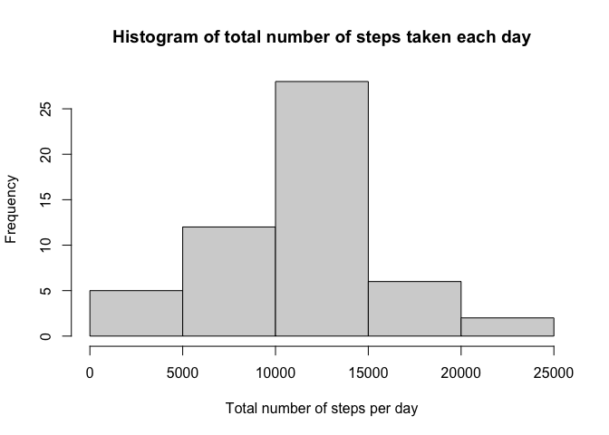
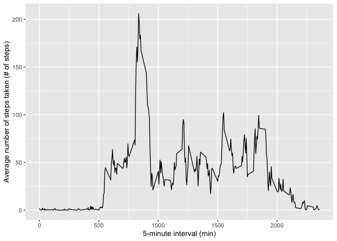
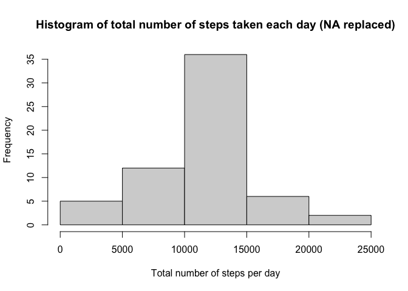
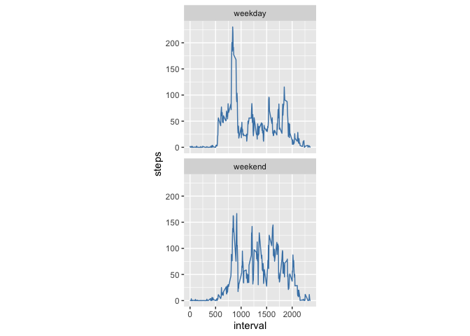

---
output:
  html_document:
    keep_md: yes
title: "PeerAssessment1_DA" 
author: "Dimitrios Andriopoulos"
date: "09/29/2021"
---


## 1. Data load & pre-process

```r
temp <- tempfile()
download.file("https://d396qusza40orc.cloudfront.net/repdata%2Fdata%2Factivity.zip",temp)
df <- read.csv(unz(temp, "activity.csv"))
unlink(temp)
df<-data.frame(df)
df<-transform(df, df$date<-as.numeric(df$date))
summary(df)
```

```
##      steps            date              interval     
##  Min.   :  0.00   Length:17568       Min.   :   0.0  
##  1st Qu.:  0.00   Class :character   1st Qu.: 588.8  
##  Median :  0.00   Mode  :character   Median :1177.5  
##  Mean   : 37.38                      Mean   :1177.5  
##  3rd Qu.: 12.00                      3rd Qu.:1766.2  
##  Max.   :806.00                      Max.   :2355.0  
##  NA's   :2304
```

## 2. What is mean total number of steps taken per day?

Next, I calculate the mean of the total number of steps (ignoring missing values)


```r
library(dplyr)
mean_df<-aggregate(steps ~ date, df, sum)
mean_answer<-mean(mean_df$steps)
print(mean_answer)
```

```
## [1] 10766.19
```

```r
mean_df$date<-as.Date(mean_df$date)
hist(mean_df$steps, xlab = "Total number of steps per day", main = "Histogram of total number of steps taken each day")
```

<!-- -->

```r
summary(mean_df$steps)
```

```
##    Min. 1st Qu.  Median    Mean 3rd Qu.    Max. 
##      41    8841   10765   10766   13294   21194
```

## 3. What is the average daily activity pattern?

```r
library(ggplot2)
mean_df3<-aggregate(steps ~ interval, df, mean)
p<-ggplot(mean_df3, aes(x=interval, y=steps))+geom_line()+xlab("5-minute interval (min)")+ylab("Average number of steps taken (# of steps)")
p
```

<!-- -->

```r
max_value<-mean_df3$interval[which.max(mean_df3$steps)]
print(paste("The 5-minute interval corresponding to the maximum number of steps, on average across all days, is", max_value))
```

```
## [1] "The 5-minute interval corresponding to the maximum number of steps, on average across all days, is 835"
```

## 4. Imputing missing values
### Questions 1 & 2 & 3
Below, you can find trhe reported missing values in the dataset, as well as my strategy to replace the missing values. Specifically, I have replaced all missing step-values by the mean steps during the corresponding 5-minute interval.

```r
library(ggplot2)
df.old<-df
count_NA<-sum(is.na(df$steps))
print(paste0("The number of dates with NA is ",count_NA))
```

```
## [1] "The number of dates with NA is 2304"
```

```r
for (i in 1:length(df.old$steps)) 
  {
  if (is.na(df.old$steps[i])) {
    df.old$steps[i]<-mean_df3$steps[mean_df3$interval==df.old$interval[i]]}
    else {
      df.old$steps[i]}
}
df_new<-df.old
```
### Question 4

```r
mean_df_new<-aggregate(steps ~ date, df_new, sum)
mean_answer_new<-mean(mean_df_new$steps)
print(mean_answer_new)
```

```
## [1] 10766.19
```

```r
mean_df_new$date<-as.Date(mean_df_new$date)
hist(mean_df_new$steps, xlab = "Total number of steps per day", main = "Histogram of total number of steps taken each day (NA replaced)")
```

<!-- -->

```r
summary(mean_df_new$steps)
```

```
##    Min. 1st Qu.  Median    Mean 3rd Qu.    Max. 
##      41    9819   10766   10766   12811   21194
```
As can be seen above, the mean and median between the original and imputed data sets are similar; something to be expected, given that I replaced "NAs" with mean values for the corresponding 5-minute intervals. What does change, however, is that the frequency of total number of steps increases in the imputed data set. 

## 5.Are there differences in activity patterns between weekdays and weekends?
### Question 1: Weekdays vs weekends

```r
library(dplyr)
df_new$date<-as.Date(df_new$date)
fun.day<-function(x) weekdays(x)
df_new$wk<-as.factor(if_else(substr(weekdays(df_new$date),1,1)=="S", "weekend","weekday"))
```

### Plot 
Indeed, from the plot below we can observe that during weekdays, activity levels peak during earlier in the day. This makes sense given that people tend to be at work later in the day. On the contrary, people tend to have a periodic activity level that ebbs and flows during the day.


```r
library(ggplot2)
m.df_new<-aggregate(steps ~ interval + wk, df_new, mean)
d <- ggplot(m.df_new, aes(interval, steps)) + geom_line(color = "steelblue", size = 0.5) + theme(aspect.ratio = 1)
d + facet_wrap(~ wk, nrow = 2)
```

<!-- -->
